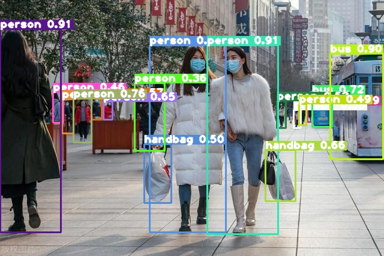
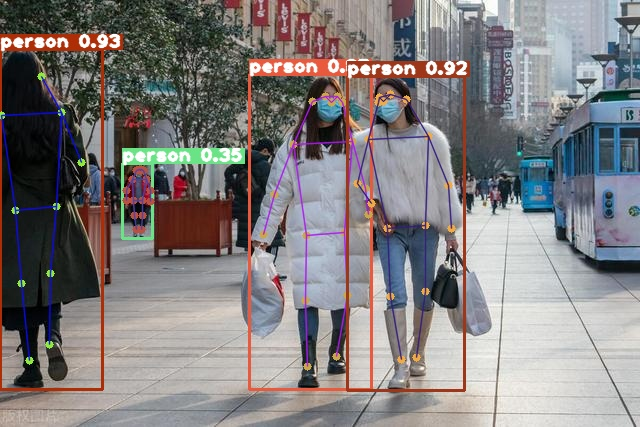
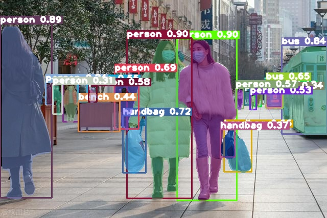

# TensorRT deploy YOLO11 detect, pose, segment，tracking

## Introduction

- Based on `TensorRT-v8` , deploy detect, pose, segment, tracking of `YOLO11`;

- Support `Jetson` series, also `Linux x86_64`;
- This project does not need to compile and install `CUDA-supported OpenCV`, all tensor operations related to pre and post processing are implemented by cuda programming;
- Mode convert: `.pth` -> `.onnx` -> `.plan(.engine)`;

- I use `Python` and `C++` 2 apis to do the implementation;
- All of them adopt object-oriented, which is easy to combine with other projects;
- The `C++` version will also be compiled as a dynamic link library, which is easy to call as an interface in other projects; 

## Effect

|            input image            |                detect                 |
| :-------------------------------: | :-----------------------------------: |
|            |  |
|             **pose**              |              **segment**              |
|  |        |

- ByteTrack


## Inference speed

|        | detect | pose  | segment |
| :----: | :----: | :---: | :-----: |
|  C++   |  3 ms  | 4 ms  |  6 ms   |
| python | 10 ms  | 13 ms |  45 ms  |

- The inference time here includes pre-processing, model inference, and post-processing
- The inference time here base on `x86_64 Linux ` ，`Ubuntu`，GPU is `GeForce RTX 2080 Ti`

## Environment

1. Base requirements：

- `TensorRT 8.0+`
- `OpenCV 3.4.0+`

**If the basic requirements are met, you can directly go to each directory and run each task **

**Environment construction can refer to the following: **

2. If  `Linux x86_64`, `docker` is recommended 

```bash
docker pull nvcr.io/nvidia/tensorrt:22.04-py3
```

- This docker image contains：

| CUDA   | cuDNN    | TensorRT | python |
| ------ | -------- | -------- | ------ |
| 11.6.2 | 8.4.0.27 | 8.2.4.2  | 3.8.10 |

- Then install opencv yourself 

3. If `Jetson`, such as `Jetson Nano`

- The burned system image is `Jetpack 4.6.1`，original environment is as follows：

| CUDA | cuDNN | TensorRT | OpenCV |
| ---- | ----- | -------- | ------ |
| 10.2 | 8.2   | 8.2.1    | 4.1.1  |

## Run

- There are three directories, `detect`, `pose` and `segment`, in both `python` and `C++` directories 
- Run as `README` under the `detect`, `pose`， `segment` and `tracking` directories respectively 

- [C++ api detect](https://github.com/emptysoal/TensorRT-YOLO11/tree/main/C%2B%2B/detect)
- [C++ api pose](https://github.com/emptysoal/TensorRT-YOLO11/tree/main/C%2B%2B/pose)
- [C++ api segment](https://github.com/emptysoal/TensorRT-YOLO11/tree/main/C%2B%2B/segment)
- [C++ api track](https://github.com/emptysoal/TensorRT-YOLO11/tree/main/C%2B%2B/)
- [Python api detect](https://github.com/emptysoal/TensorRT-YOLO11/tree/main/python/detect)
- [Python api pose](https://github.com/emptysoal/TensorRT-YOLO11/tree/main/python/pose)
- [Python api segment](https://github.com/emptysoal/TensorRT-YOLO11/tree/main/python/segment)
- [Python api track](https://github.com/emptysoal/TensorRT-YOLO11/tree/main/python)
