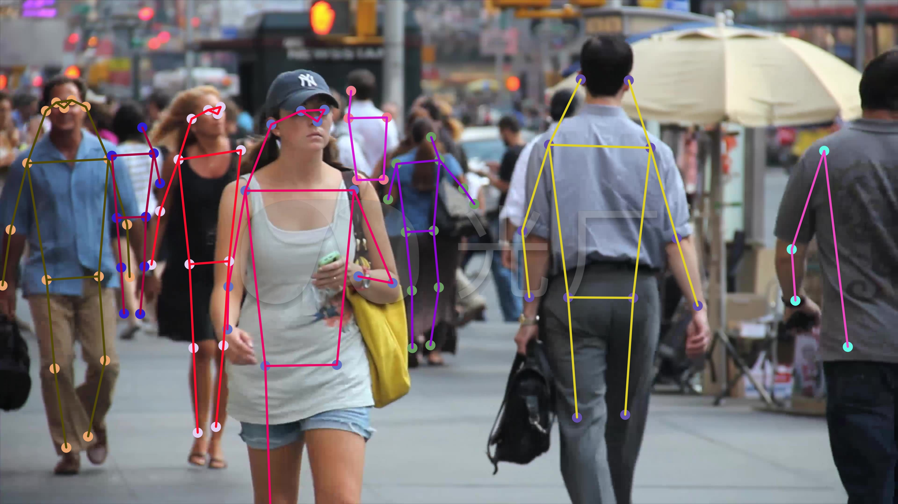

# TensorRT deploy YOLO11 pose



## Get onnx

```bash
pip install ultralytics
pip install onnx==1.14.0
pip install onnxslim==0.1.34
```

write export_onnx.py, as follow:

```python
from ultralytics import YOLO

model = YOLO("./weights/yolo11s-pose.pt")
path = model.export(format="onnx", simplify=True, device=0, opset=12, dynamic=False, imgsz=640)
```

run export_onnx.py

```bash
python export_onnx.py
```

`yolo11s-pose.onnx` will be generated

## To TensorRT

python packages:

```bash
tensorrt==8.2.4.2
cuda-python==12.1.0
opencv-python==4.9.0.80
```

1. Switch to the current project directory;
2. If the model is trained on your own dataset, remember to check `config.py`; 
3. Create `onnx_model` directory and put the exported `onnx` model in
4. Run as follow:

```bash
python main.py
```